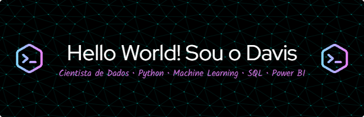

  

- 📊 Pós-Graduando em <b>Ciência de Dados</b> pela Pontifícia Universidade Católica do Rio de Janeiro (PUC-Rio);
- ⚛️ Graduado em <b>Física</b>  pelo Instituto Federal do Tocantins;          
- 💻 Possuo sólida experiência com Python, atuando com bibliotecas como Pandas, scikit-learn e técnicas de Machine Learning e Clusterização;
- 📈 Tenho experiência consolidada em Power BI, criando dashboards interativos e relatórios que facilitam a tomada de decisão baseada em dados;
- 🚀 Meu foco é desenvolver soluções analíticas ágeis, escaláveis e orientadas a resultados, unindo modelagem, visualização e eficiência. 
  

  
  

  <h2>💻 Data Tools & Technologies</h2>

  
  
  
  
   
  
  
  
  
  
  

          

  <h2>📫 Contato</h2>

  

